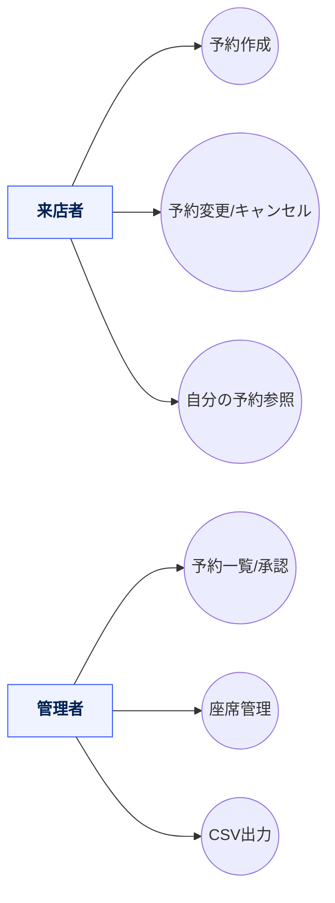
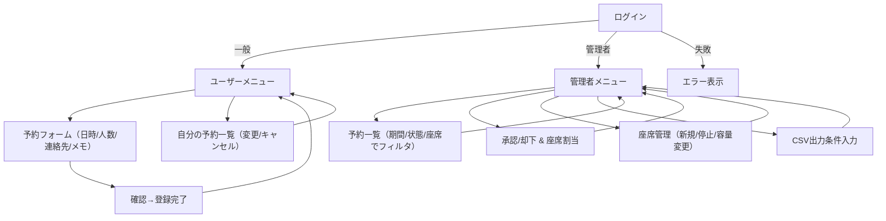
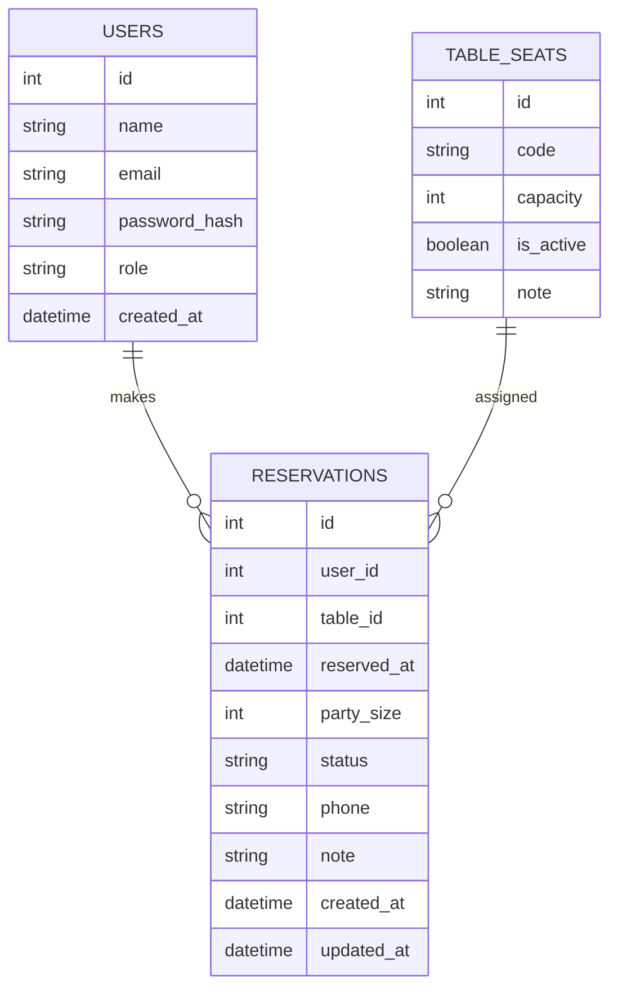
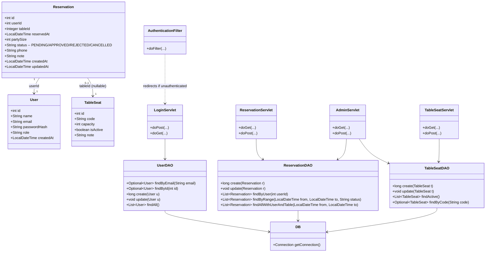

# ReservationApp（前期版）— 予約管理ミニシステム

**来店予約（作成／変更／キャンセル）**、**空席・座席管理**、**予約一覧・承認**、**CSV 出力**を行う学習用 Web アプリです。  
Jakarta Servlet (Servlet 5) + JSP を前提とした教育・演習向けテンプレートです。

> **注**: 本 README はテンプレートです。実装クラス名・パス・DB 名などはあなたのプロジェクトに合わせて調整してください。

---

## 目次

- [機能](#機能)
- [アーキテクチャ](#アーキテクチャ)
- [ディレクトリ構成](#ディレクトリ構成)
- [セットアップと起動](#セットアップと起動)
- [ユーザーストーリー](#ユーザーストーリー)
- [ユースケース図（Mermaid）](#ユースケース図mermaid)
- [画面遷移図（Mermaid）](#画面遷移図mermaid)
- [ER 図（Mermaid）](#er-図mermaid)
- [クラス図（Mermaid）](#クラス図mermaid)
- [クラス設計表（責務・主要メソッド）](#クラス設計表責務主要メソッド)
- [用語辞書](#用語辞書)
- [ライセンス](#ライセンス)

---

## 機能

**一般ユーザー**
- 予約の作成（日時・人数・連絡先・希望メモ）
- 予約の変更・キャンセル
- 自分の予約履歴の参照

**管理者**
- 予約一覧（期間／状態／座席でフィルタ・ソート）
- 予約の承認・却下、座席割り当て
- 座席（テーブル）管理
- CSV 出力（期間・状態で抽出）

---

## アーキテクチャ

- **言語／ランタイム**: Java（Jakarta Servlet 5 互換）
- **ビュー**: JSP + JSTL + CSS
- **DB**: PostgreSQL（サンプル SQL 付）
- **構成**: Model（Entity） / DAO / Servlet（Controller） / Filter（Auth） / JSP（View）

---

## ディレクトリ構成

> 代表的な構成（Eclipse Dynamic Web Project / `src/main` 配下）

```text
src/
└─ main
   ├─ java/
   │  └─ com/example/reservation/
   │     ├─ entity/
   │     │  ├─ User.java
   │     │  ├─ Reservation.java
   │     │  └─ TableSeat.java
   │     ├─ dao/
   │     │  ├─ UserDAO.java
   │     │  ├─ ReservationDAO.java
   │     │  └─ TableSeatDAO.java
   │     ├─ servlet/
   │     │  ├─ LoginServlet.java
   │     │  ├─ ReservationServlet.java
   │     │  ├─ AdminServlet.java
   │     │  └─ TableSeatServlet.java
   │     ├─ filter/
   │     │  └─ AuthenticationFilter.java
   │     └─ util/
   │        └─ DB.java
   └─ webapp/
      ├─ WEB-INF/
      │  ├─ web.xml
      │  └─ views/
      │     ├─ login.jsp
      │     ├─ menu_user.jsp
      │     ├─ menu_admin.jsp
      │     ├─ reservation_form.jsp
      │     ├─ reservation_list.jsp
      │     ├─ my_reservations.jsp
      │     └─ tables_admin.jsp
      ├─ style.css
      └─ index.jsp
```

## セットアップと起動
1) 事前準備

 - Java 17 以上（推奨）

 - Tomcat 10.1+ または Jetty 11+（Jakarta 名前空間対応）

 - PostgreSQL 15+（サンプルでは reservation_db を使用）

2) DB 初期化（サンプル）
```text
-- DB 作成
CREATE DATABASE reservation_db;

-- アプリ用ユーザー
CREATE USER reservation_app WITH PASSWORD 'password';
GRANT ALL PRIVILEGES ON DATABASE reservation_db TO reservation_app;

-- スキーマ
CREATE TABLE users (
  id SERIAL PRIMARY KEY,
  name TEXT NOT NULL,
  email TEXT UNIQUE NOT NULL,
  password_hash TEXT NOT NULL,
  role TEXT NOT NULL DEFAULT 'USER', -- USER / ADMIN
  created_at TIMESTAMP NOT NULL DEFAULT NOW()
);

CREATE TABLE table_seats (
  id SERIAL PRIMARY KEY,
  code TEXT UNIQUE NOT NULL,        -- 例: T01, C02
  capacity INTEGER NOT NULL,        -- 着席可能人数
  is_active BOOLEAN NOT NULL DEFAULT TRUE,
  note TEXT
);

CREATE TYPE reservation_status AS ENUM ('PENDING','APPROVED','REJECTED','CANCELLED');

CREATE TABLE reservations (
  id SERIAL PRIMARY KEY,
  user_id INTEGER NOT NULL REFERENCES users(id),
  table_id INTEGER REFERENCES table_seats(id),
  reserved_at TIMESTAMP NOT NULL,   -- 予約日時（来店予定）
  party_size INTEGER NOT NULL,      -- 人数
  status reservation_status NOT NULL DEFAULT 'PENDING',
  phone TEXT,
  note TEXT,
  created_at TIMESTAMP NOT NULL DEFAULT NOW(),
  updated_at TIMESTAMP NOT NULL DEFAULT NOW()
);

-- 管理者の作成例（パスワードはハッシュ化して入れる想定）
INSERT INTO users (name, email, password_hash, role)
VALUES ('管理者', 'admin@example.com', '{BCRYPT_HASH_HERE}', 'ADMIN');

-- 座席のサンプル
INSERT INTO table_seats (code, capacity) VALUES
('T01', 2), ('T02', 2), ('T03', 4), ('T04', 4), ('C01', 6);
```

3) 接続設定

DB.java（または環境変数）で接続情報を設定:
```text
JDBC_URL=jdbc:postgresql://localhost:5432/reservation_db
DB_USER=reservation_app
DB_PASSWORD=password
```

4) 実行

### Eclipse + Tomcat
プロジェクトを “Dynamic Web Project” としてインポート → Tomcat にデプロイ → http://localhost:8080/ へアクセス

### Jetty（任意）
jetty-maven-plugin を設定済みなら:
```text
mvn jetty:run
# → http://localhost:8080/
```

## ユーザーストーリー

### 来店者として、スマホから空き状況を見て予約し、変更やキャンセルを自分で完結したい。

## 管理者として、予約リクエストを承認し、座席割り当てと当日運用、月次の予約データ出力まで行いたい。

### ユースケース図


### 画面遷移図


### ER 図


### クラス図


### クラス設計表（責務・主要メソッド）
| クラス                    | 役割（責務）               | 主要メソッド                                          | 共同作業相手                                     |
| ---------------------- | -------------------- | ----------------------------------------------- | ------------------------------------------ |
| `User`                 | アカウント情報              | getter/setter                                   | `UserDAO`                                  |
| `TableSeat`            | 座席（テーブル）のモデル         | getter/setter                                   | `TableSeatDAO`                             |
| `Reservation`          | 予約レコード               | getter/setter                                   | `ReservationDAO`, `User`, `TableSeat`      |
| `UserDAO`              | `users` への永続化        | `findByEmail`, `create`, `findAll`              | `DB`, `LoginServlet`                       |
| `TableSeatDAO`         | `table_seats` への永続化  | `findActive`, `findByCode`, `update`            | `DB`, `AdminServlet`, `TableSeatServlet`   |
| `ReservationDAO`       | `reservations` への永続化 | `create`, `update`, `findByUser`, `findByRange` | `DB`, `ReservationServlet`, `AdminServlet` |
| `DB`                   | JDBC 接続提供            | `getConnection`                                 | すべての DAO                                   |
| `AuthenticationFilter` | 未ログインアクセスの遮断         | `doFilter`                                      | すべての Servlet                               |
| `LoginServlet`         | 認証・セッション開始           | `doPost`, `doGet`                               | `UserDAO`, `AuthenticationFilter`          |
| `ReservationServlet`   | ユーザー予約機能             | `doGet`, `doPost`                               | `ReservationDAO`                           |
| `AdminServlet`         | 管理者機能（一覧/承認/CSV）     | `doGet`, `doPost`                               | `ReservationDAO`, `TableSeatDAO`           |
| `TableSeatServlet`     | 座席管理                 | `doGet`, `doPost`                               | `TableSeatDAO`                             |


### 用語辞書
| 用語                 | 意味                                                                 |
| ------------------ | ------------------------------------------------------------------ |
| 予約                 | 来店日時・人数・連絡先等を持つエンティティ                                              |
| 予約状態（status）       | `PENDING`（申請中）/ `APPROVED`（承認）/ `REJECTED`（却下）/ `CANCELLED`（キャンセル） |
| 座席（TableSeat）      | 店舗内のテーブル・カウンター等。収容人数（capacity）を持つ                                  |
| 座席割り当て             | 予約に対して具体的な座席を紐づける運用                                                |
| 予約日時（reserved\_at） | 来店予定の日時（タイムゾーンはサーバ既定を想定）                                           |
| 人数（party\_size）    | 予約の利用人数                                                            |


## ライセンス
### 教育目的のサンプル。必要に応じてプロジェクト方針に合わせて追記してください。
```text
::contentReference[oaicite:0]{index=0}
```
